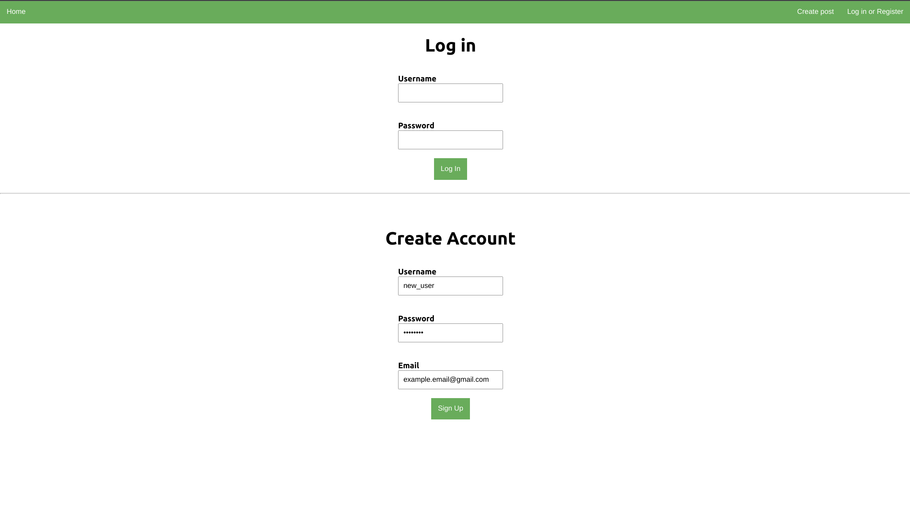
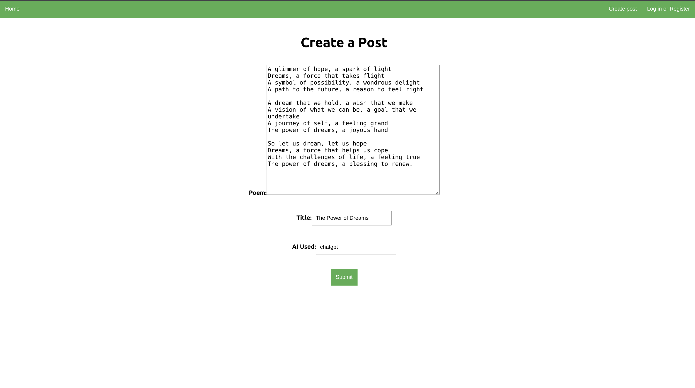
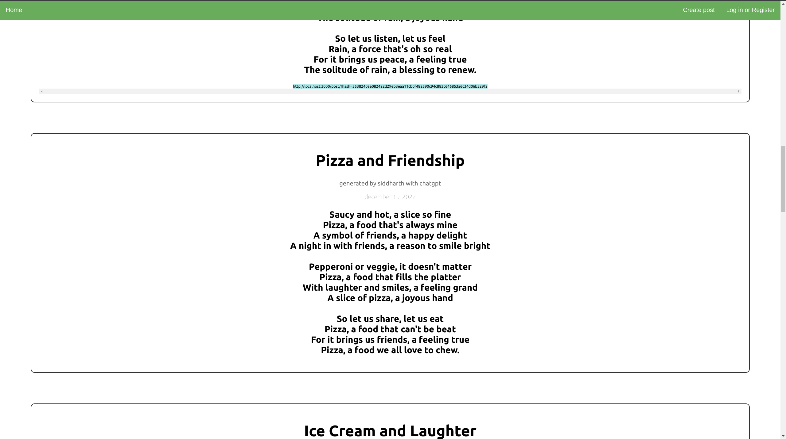

<h1 align="center">AI Poem Sharing Social Media - A Learning Project</h1>

## Overview
In this project I aimed to apply some of the cybersecurity and web development knowledge I've gained in my free time recently by creating a full-stack social media app with a React front end and a back end made with Node, Express, and MySQL.

## Core Functionallity of the Web-App
This web app is a bare-bones social media app where users can log in to and create accounts, create posts (only if they are logged in to a valid account), and browse the other posts.

### Log in and registration page:

 - Users must register with unique usernames and emails (implemented error handling to deal with invalid registration or log in on the client and server side)
  - Upon registering or logging in to a valid account, users get a JSON Web-token stored in the local storage of their browser which is later used to authenticate the users for creating posts later
  - Appropriate redirection implemented

  ### Create post page

  

 - Only validated users are able to successfully post and other users are forced to go home or register

   ### Home page

  

 - Displays the posts with their original formatting
 - Functionallity for users to share posts by generating unique links to view each post individually
 - Timestamps for the dates uploaded

 ## Takeaways and next steps
This was an awesome project to create in order to apply some of the recent knowledge I've gained from CTFs I've been going through in my free time. Mainly, I was able to use and manipulate HTTP requests and responses and see the security drawbacks that could come with them along with them and how to overcome those. 

I also sharpened my fullstack engineering knowledge in every aspect. My backend engineering skills imporved by working more in depth with express than I ever have before along with interacting with encryption modules and MySQL. My frontend skills widened because I utillized cookies and local storage to make this project come true along with practicing complex routing to be able to display each post individually.

There are many ways this project can be made more secure and be re-designed have a better user experience but as of this update I'm putting a hold on this project to go back to learning cybersecurity through completing CTFs. 

If you made it to this point, thank you very much for reading through this post. If you ever want to work with me, propose a project, or discuss anything related to my skills displayed, please reach out to me at ziv@ucsb.edu.